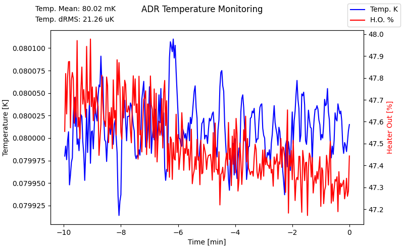

We needed an applet to watch the temperature of a cryo system.
There already was a tool to dump the temp value, time and the % of max heater output current to a csv live.

The bones of the animation were put together by Goncalo Baptista but I stole it and reworked some of the vis so now it's mine. 

plot_live.py
--

This plots (as written) the last hour of temp evolution with a rolling window.
If I've done it right, this does not hold anything in the cache and has at least 1 night of over-night operations confirmed.

Example output: 
`python plot_live.py ADRLog_example.txt`

