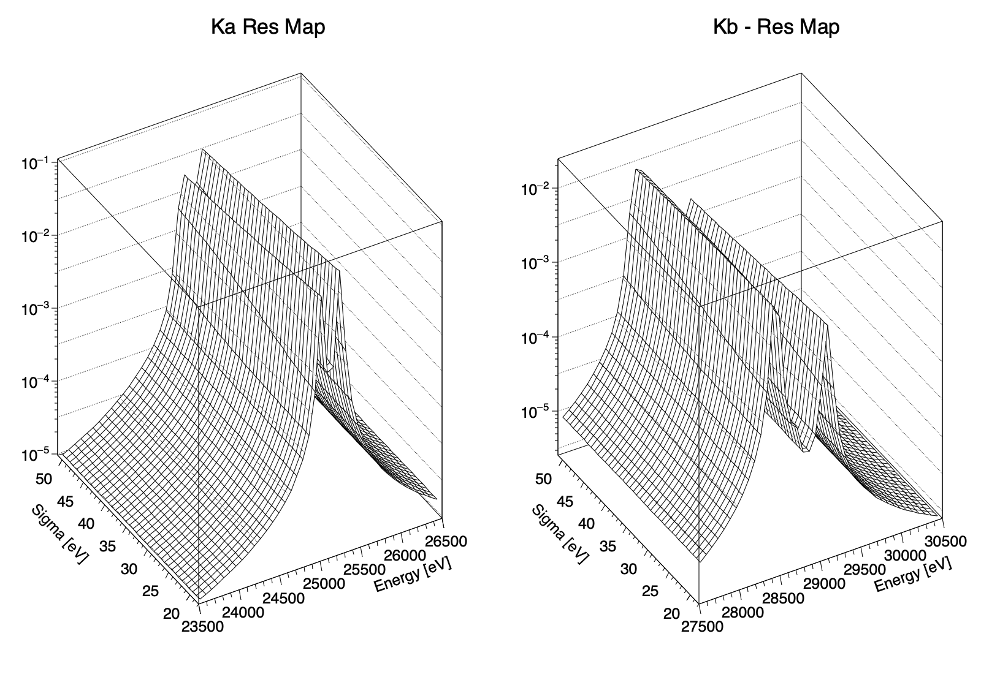

Adding a detector response model
--

 we need to apply a detector response model.

I approximate this with a gaussian but we have a problem. If I calculate a full convolution in a fitting routine, the sun will die before my fit completes.

We solve this by making a look-up table.

`DR_lookup.C` 
--
loads the csv output from before into a pair of TGraphs and performs a simple convolution at many different detector response sigmas. 

The plan then would be to perform a Delaunay interpolation inbetween the points in the fit loop.
The number of sigmas overwhich the convolution is performed and the resolution of the convolution are free params and should be checked to be sufficiently precise. 

 

Example output: 

