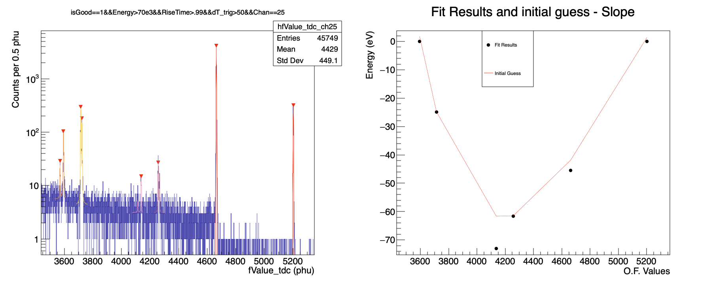

Fit Spectrum
--

With the lines prepared we can now fit. 

# Utils.C filelist.C and Graphical_Cut_List.C
These do what they say on the tin. 

`Utils.C` has some basic functions for data retrieval and plotting that I port around to most little projects. 

`filelist.C` is just a vector of TString pointers I use to organize the input data. 

`Graphical_Cut_List.C` is a list of graphical cut objects that we've made for various applicaitons that, again, get port around to different studies. 

# `run_cal.C`

This guy is in charge. It pulls the relevent file from the file list, make the pulse height histograms and finally calls the calibrate script. 

# `calibrate_57Co.C`
The heart of the fitting is done here. 

The two structs `EscapeTF1_ka` and `EscapeTF1_kb` (L3-L23) turn the look-up table generated  into a function compatable with the ROOT fitting engine. 

In both cases, because I am fitting an escape peak, the `x` (pulse height) variable is negative and I add an energy offset equal to the energy of the strongest line. 
As long as this number is taken literally and reused in the energy separation calculations (L104-L112) this off-set only acts to minimize parameter coorelations with the 122 peak off of which it is referenced. 

Calibration plan: 
1. Find the 122 keV peak (it's big) -> gaussian fit
2. Run the peak finder (`->ShowPeaks()`)
   * sigma from the 122 is a necessary input
   * drop peaks found below 93 keV
   * drop peaks that are too close to eachother (3 keV)
   * iterate with decreasing threshold until 6 peaks survive
3. Use ID'd peak centroids as input guesses
4. Plotting and saving  

### Failure modes
In low statistics cases the peak finder guesses the wrong peak in each of the doublets sometimes. This must be corrected by hand. I keep the doublets paired for exactly this case however as fitting with two peaks simultaneously should get us "bonus statistics" as long as the fit finds the right minimum. 

Minuit sometimes fails to converge, the EDM threshold is ~E-6, as long as the fit produces an error bar and has the right peaks it should be usable. 

I generally check for failures in the saved canvas: 

On the left is the spectrum with the fit results overlaid. The peak finder leaves the little red arrows; nice to check if it's behaving. 
On the right is the input guess vs. result graph with the general optimal filter vs energy slope subtracted. 

10s of eV /keV deviation from linear is not too weird. . 
