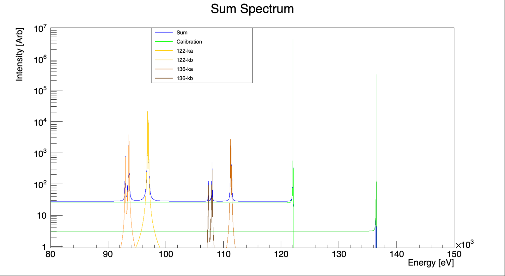

Tin-Ka line preparation
--

Here I have some ROOT scripts I use to generate templates from MDFGME outputs that Jorge sent me.

I assume access to a CSV with columns of energy, intensity and width.

I use the maketemplates.C to dump to terminal the outputs:

`root maketemplates.C > template.csv`

or equivalent, and clean it up after. 

`plotlines_template.C` Then plots the template lines.  

`plotlines.C` skips the saving process and is just nice if you want to look at the spectrum. I added a little ATan background aswell. 

This is not an exact copy of the working directory. 
